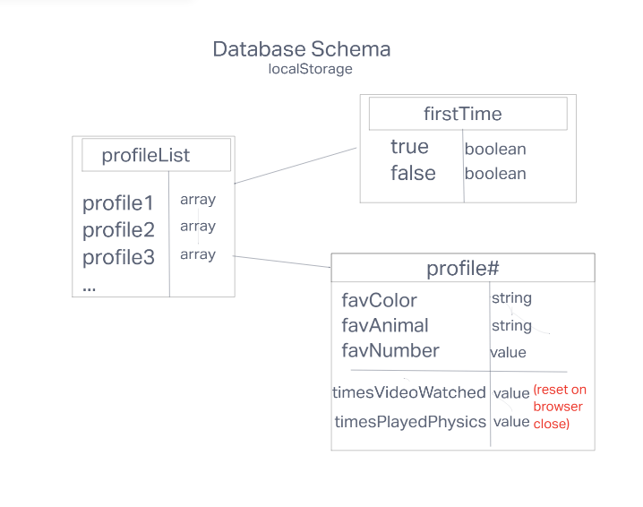

# Byte Size Adventurez

**Team Members**

* Heather Holcomb
* Kyle White
* Ike Steoger
* Francisco Sanchez

***

## About the Application

- This is an app for pre-school kids around the world to entertain themselves without parental supervision. The idea is to have an app that allows kids to go through the website on their own and discover a few different pathways of interactivity such as: a splash page with a question of picking their favorite color and having the page show up as that color, clicking on a picture that links them to their favorite videos, a separate page for to a physics based game, and a rewards/progress tracker so that they can view what they've done the next time they access the website! 

- Although this application is primarily designed to be used with the english language, there is minimal text so that it is possible to be used in any language.

- See [Software Requirements](requirements.md) for more detailed information on problem domain and product vision. 

***

## Version Control 

| Version | Updates |
| ------- | :------ |
| Version 1.0.2 |   Updated project documentation with software requirements, PM board link, wireframes, and data schema.  | 
| Version 1.0.1 |   Changed name to Byte Size Adventurez along with Org name. Updated the README to include the about section for the app. Created a development branch and locked down the main branch. | 
|Version 1.0.0 | Creation of project/app repository and added MD file for team agreement which includes links to all project tools | 

## Database Schema Diagram

We are using `localStorage` database.

The `firstTime` is the check if this is their first visit, and this would be stored beyond refresh/close. The `profileList` is a set of objects that hold arrays of data and would be stored beyond refresh/close. The `profile#` increments up one # for each profile and holds user inputted data that is held beyond refresh/close but also holds information on interaction with the website, which would be reset after refresh/close.

***

## Project Management Board

Trello Board with User Stories: https://trello.com/invite/b/XPyrgxGS/ATTI889daf6b63ce34727da86aaffcc7f4daE7D2D2FD/byte-size-adventurez-app 

